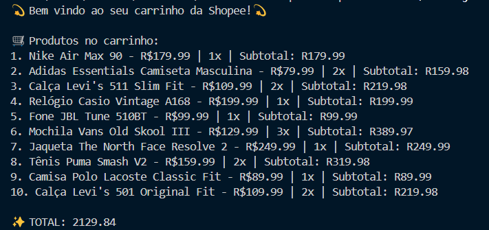

# 🛒 Carrinho de Compras Shopee

Projeto simples de um **carrinho de compras inspirado na Shopee**, desenvolvido para praticar conceitos de **JavaScript assíncrono**, manipulação de arrays e lógica de programação.

## 📌 Descrição

Este projeto simula um sistema de carrinho de compras onde é possível:

- Criar itens com nome, preço e quantidade
- Calcular automaticamente o subtotal de cada item
- Exibir os itens adicionados no carrinho
- Praticar funções assíncronas com `async/await`

## 🚀 Funcionalidades

- 📦 Criar e armazenar produtos com nome, preço e quantidade  
- 🧮 Cálculo automático de subtotal (`preço × quantidade`)  
- 📋 Exibição formatada do carrinho no console  
- 💬 Mensagens organizadas com `console.log` para acompanhar o fluxo  

## 🛠️ Tecnologias

- JavaScript
- Node.js

## 📁 Estrutura

